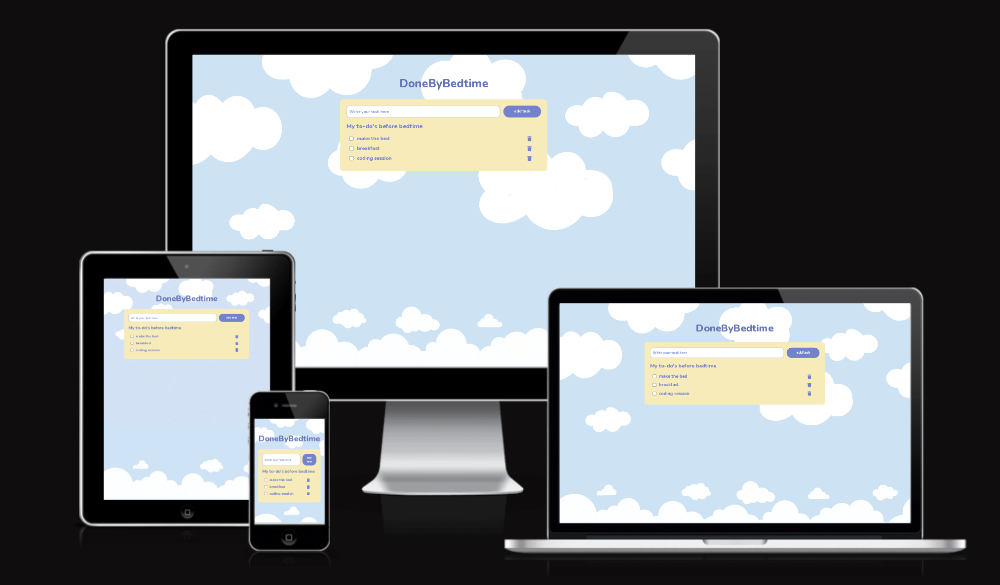
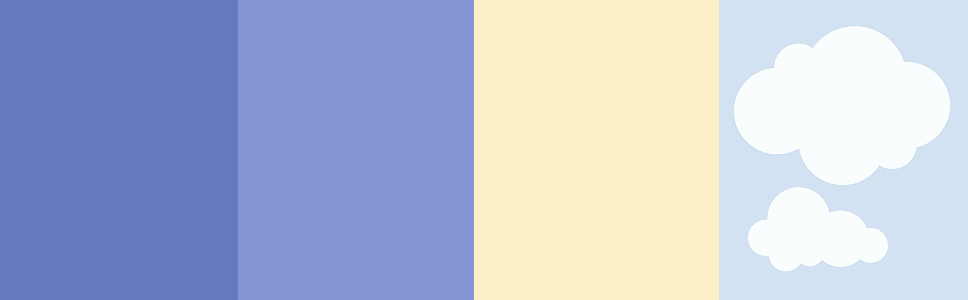
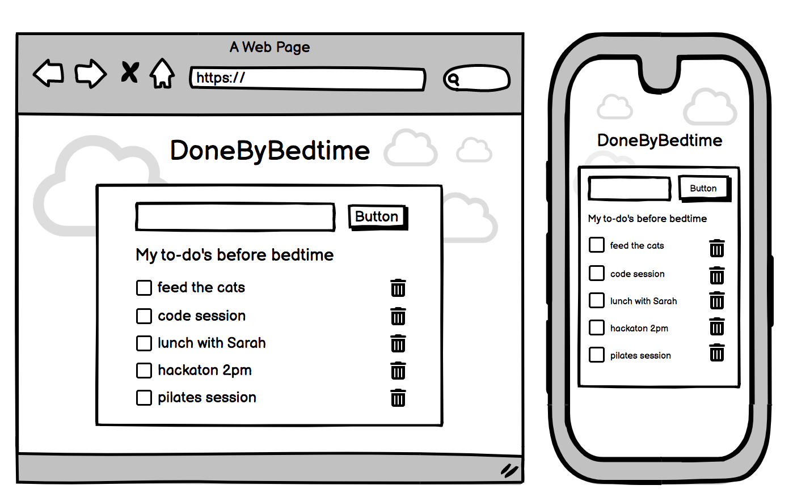
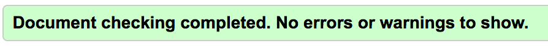
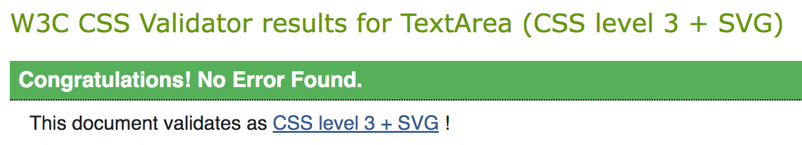

# DoneByBedtime
The goal of this website is to increase visitor productivity and give the visitor a overview of tasks to be done for the day. This website let’s the visitor create a to-do list. When an item is done, it can be checked and you can remove the task item. 

[Here is a link to the project](https://madelenviola.github.io/project2)

## User Story
### Why users should visit the website
- To create a to-do list
- To check off tasks completed
- To increase productivity
- To get a overview of todays tasks

## Features
### Create to-do list
- Add task in the input window and press add task button.
- New task will be added to the list underneath.
- When task is completed the visitor can check it off using the checkbox.
- If the visitor wants to remove a task they can click on the trash can and the task will be removed.
- If no task is added, alert will tell the visitor to add a task.

## Future features
### Features and functions to be added in the future.
- Plan ahead and make lists for multiple dates.
- Custom message if field not filled in instead of alert.

## Typography and color scheme
The font used is bold version of [Nunito from Google Fonts](https://fonts.google.com/specimen/Nunito) with sans-serif as fallback font. The font used was chosen to align with the look and feel of the design due to the soft and playful roundness. 
The color scheme is a combination of light blue, white, muted purple and light yellow. 

## Design
### The look and feel of the website.
The goal of the design was for it to be simple, soft and serene. The design is a combination of muted but contrasting colors with two cloud illustration elements as background and footer. 
- The to-do list is displayed in a light yellow box that grows as the to-do list expands with each user input added to-do.
- The button to add task is purple pill button with CTA "add task". 
- The list items added to the to-do list features a checkbox to the left and input task text to the right.
- A purple trash can icon from [FontAwesome](https://fontawesome.com/icons/trash-can?s=solid&f=classic) displays to the right of each task that the user inputs. When clicked the task is removed from the to-do list. 

## Images
- Background image featuring clouds from [Freepik](https://www.freepik.com/) by [Rawpixel.com](https://www.freepik.com/free-vector/cute-background-with-fluffy-cloud-pattern_16359188.htm)
- Footer image created in Photoshop with the use of a cloud vector from [Freepik](https://www.freepik.com/) by [Rawpixel.com](https://www.freepik.com/free-vector/cloud-sticker-clipart-vector-set-flat-design_18705168.htm#query=cloud&position=6&from_view=search&track=sph)
- Responsive mockup by [ui.dev](https://ui.dev/amiresponsive?url=https://madelenviola.github.io/project2/index.html)
- Trash can icon from [FontAwesome](https://fontawesome.com/icons/trash-can?s=solid&f=classic)
- The images used on the website are compressed with [tinypng](https://tinypng.com/)

## Wireframe
The wireframe was created in [Balsamiq](https://balsamiq.com/) 

## Technology
- HTML5
- GitPod Online IDE
- GitHub host repository
- Google Fonts
- CSS3
- JavaScript
- Photoshop
- Balsamiq
- Python Tutor
- Font Awesome
- TinyPNG

## Testing
### Code validation
- HTML tested via [W3C](https://validator.w3.org/)
- CSS tested via [W3C](https://jigsaw.w3.org/css-validator/)
- JavaScript tested via 
- Accessability, performance, best practises and seo check by [PageSpeed Insights](https://pagespeed.web.dev/)

### W3C HTML validator findings:
HTML code passed in [W3C HTML Validator](https://validator.w3.org/) without errors.

### W3C CSS validator findings:
CSS code passed in [W3C CSS Validator](https://jigsaw.w3.org/css-validator/) without errors.

### JSHINT validator findings:
- metrics:
There are 11 functions in this file.
Function with the largest signature take 2 arguments, while the median is 1.
Largest function has 13 statements in it, while the median is 4.
The most complex function has a cyclomatic complexity value of 2 while the median is 1.

- Warnings:
There are warnings related to ES6 but today this is supported by most browsers.
The let warning is directly called from HTML.

### PageSpeed Insights findings:
- coming soon.

### User testing
- coming soon.

### Browsers
- coming soon.

### Fixed bugs
- coming soon.

### Supported screens
- Smartphone, tablet and desktop sizes. 

### Known bugs
- coming soon.

## Deployment
- When you visit the GitHub repository, click on the Settings tab, and choose **Pages** from the menu
- From source drop-down menu, choose **Master Branch**
- When master branch has been selected, the page will refresh to show if deployment was successful. 

# Credits

Tutorial ”Learn how to create a "to-do list" with CSS and JavaScript” by [W3C Schools](https://www.w3schools.com/howto/howto_js_todolist.asp)

# Credits design elements
- Background image featuring clouds from [Freepik](https://www.freepik.com/) by [Rawpixel.com](https://www.freepik.com/free-vector/cute-background-with-fluffy-cloud-pattern_16359188.htm)
- Footer image created in Photoshop with the use of a cloud vector from [Freepik](https://www.freepik.com/) by [Rawpixel.com](https://www.freepik.com/free-vector/cloud-sticker-clipart-vector-set-flat-design_18705168.htm#query=cloud&position=6&from_view=search&track=sph)
- Responsive mockup by [ui.dev](https://ui.dev/amiresponsive?url=https://madelenviola.github.io/project2/index.html)
- Trash can icon from [FontAwesome](https://fontawesome.com/icons/trash-can?s=solid&f=classic)
- The images used on the website are compressed with [tinypng](https://tinypng.com/)

# Acknowledgement

[W3Schools](https://www.w3schools.com/) for it's great tutorial material and learning material.

My mentor at Code Institute, Sandeep Aggarwal who has mentored me through mindboggling bugs with understandable feedback during this project.  
